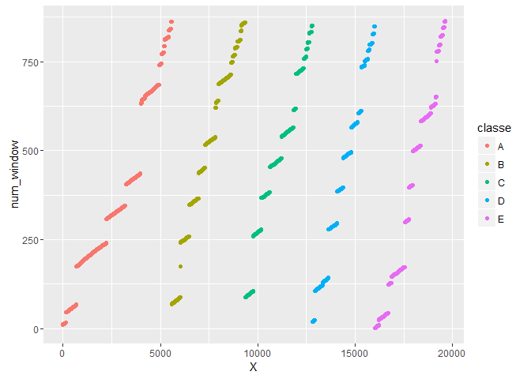

I used a subset of data
(<https://d396qusza40orc.cloudfront.net/predmachlearn/pml-training.csv>)
from the
[http://groupware.les.inf.puc-rio.br/har\#dataset\#ixzz4cSvunXAe](http://groupware.les.inf.puc-rio.br/har#dataset#ixzz4cSvunXAe)
to predict classe, which range from A to E and correspond to various
ways of performing bicep curls.

    train1<-read.csv("C:/Users/Owner/Documents/pml-training.csv")
    library(caret)

The starting dataset has 19622 observations and 160 variables.

    dim(train1)

    ## [1] 19622   160

Sifting Out Variables
---------------------

I first reduced the number of columns in the dataset by removing columns
with near zero variances. I took out all the columns with NA values
because each of them had 19,216 NA values. Due to each of these
previously mentioned columns only having numerical values for two
percent of the observations, I decided to omit them as predictors.

    nearzero<-nearZeroVar(train1)
    train2<-train1[,-nearzero]

    findna<-colSums(sapply(train2, is.na))
    head(findna[findna>0])

    ##        max_roll_belt       max_picth_belt        min_roll_belt 
    ##                19216                19216                19216 
    ##       min_pitch_belt  amplitude_roll_belt amplitude_pitch_belt 
    ##                19216                19216                19216

    train2<-train2[,findna==0]

I also got rid of the first five columns which dealt with observation
number (X), username, and timestamps as well as num\_window (the sixth
column). As shown in the plot below, num\_window increases similarly as
observation number goes up within each classe.

    qplot(X, num_window, data = train2, color=classe)

    train2<-train2[,-c(1:6)]

Now 53 variables remain.

Creating the Model
------------------

I split 75 percent of the observations into a training set and the rest
into a validation set.

    set.seed(325)
    inTrain<-createDataPartition(train2$classe, p=0.75, list=FALSE)
    traindata<-train2[inTrain,]
    validdata<-train2[-inTrain,]

A random forest algorithm was used to predict classe using the remaining
52 variables because it is one of the most accurate algorithm. However,
I used cross validation with 10 subsamples within the trainControl
attribute of the train function to avoid overfitting.

    set.seed(325)
    modelFit<-train(classe~., data=traindata, method="rf", trControl= trainControl(method="cv", number=10, allowParallel = TRUE))

Predicting
----------

The model was used to predict the classe of the observations in the
validation set. The Accuracy of the model on the validation data is
99.55%, therefore I estimate out-of-sample error to be a low 0.45%.

    predmod<-predict(modelFit, validdata)
    confusionMatrix(predmod, validdata$classe)

    ## Confusion Matrix and Statistics
    ## 
    ##           Reference
    ## Prediction    A    B    C    D    E
    ##          A 1395    3    0    0    0
    ##          B    0  945    7    0    0
    ##          C    0    1  848    9    0
    ##          D    0    0    0  794    1
    ##          E    0    0    0    1  900
    ## 
    ## Overall Statistics
    ##                                           
    ##                Accuracy : 0.9955          
    ##                  95% CI : (0.9932, 0.9972)
    ##     No Information Rate : 0.2845          
    ##     P-Value [Acc > NIR] : < 2.2e-16       
    ##                                           
    ##                   Kappa : 0.9943          
    ##  Mcnemar's Test P-Value : NA              
    ## 
    ## Statistics by Class:
    ## 
    ##                      Class: A Class: B Class: C Class: D Class: E
    ## Sensitivity            1.0000   0.9958   0.9918   0.9876   0.9989
    ## Specificity            0.9991   0.9982   0.9975   0.9998   0.9998
    ## Pos Pred Value         0.9979   0.9926   0.9883   0.9987   0.9989
    ## Neg Pred Value         1.0000   0.9990   0.9983   0.9976   0.9998
    ## Prevalence             0.2845   0.1935   0.1743   0.1639   0.1837
    ## Detection Rate         0.2845   0.1927   0.1729   0.1619   0.1835
    ## Detection Prevalence   0.2851   0.1941   0.1750   0.1621   0.1837
    ## Balanced Accuracy      0.9996   0.9970   0.9947   0.9937   0.9993

Data source: Ugulino, W.; Cardador, D.; Vega, K.; Velloso, E.; Milidiu,
R.; Fuks, H. Wearable Computing: Accelerometers' Data Classification of
Body Postures and Movements. Proceedings of 21st Brazilian Symposium on
Artificial Intelligence. Advances in Artificial Intelligence - SBIA
2012. In: Lecture Notes in Computer Science. , pp. 52-61. Curitiba, PR:
Springer Berlin / Heidelberg, 2012. ISBN 978-3-642-34458-9. DOI:
10.1007/978-3-642-34459-6\_6.
